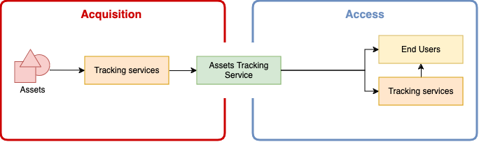
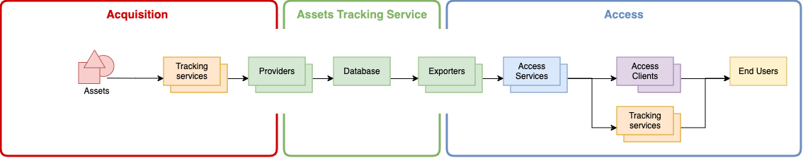

# BAS Assets Tracking Service - Implementation

## Architecture

## Overview

At a high level, the major actors in this project are:

- *assets*: things that have a position (which typically changes regularly but can be static)
- *tracking services*: that record and transmit asset positions to a [Provider](#providers)
- *end users*: who want to know the position of one or more assets

End users may access information through a combination of:

- primary (upstream) tracking services (i.e. that receive data from the GPS device tracking an asset)
- this service, via one of it's [Exports](#exporters)
- another service dependant on this service (such as the Embedded Maps Service)
- (other unrelated services (such as Flight Radar, Marine Traffic, etc.) - out of scoope for this documentation)

As a high-level data flow:

Where:
- a primary tracking service receives data from an asset
- the data is acquired from the primary tracking service by this application
- the data is accessed from this application by an end-user, or by another tracking service (and in turn by end-users)

## Components

At a lower level, this project can be broken down into:

- *assets*: things that have a position (which typically changes but can be static)
- *tracking services (primary)*: services that collect asset positions and return them to clients
- [*Providers*](#providers): interfaces between primary tracking services and this application
- [*Database*](#database): store of acquired asset and position information
- [*Exporters*](#exporters): interfaces between this application and an access service
- *access services*: services that allow access to data through a protocol and format (e.g. an OGC Features API)
- *access clients*: tools that allow end users to view and analyse data from an access service (e.g. QGIS)
- *end users*: individuals that want to know the position of one or more assets
- *tracking services (secondary)*: services that collect asset positions from this service for use by end users

As a lower-level data flow:

Where:
- a primary tracking service receives data from an asset
- the data is acquired from the primary tracking service via an application [Provider](#providers)
- the data is stored in the application [Database](#database)
- the data is pushed into access services via an application [Exporter](#exporters)
- the data is accessed by end users using a tool or service, either:
  - directly from this service through an access service
  - indirectly from another tracking service that has acquired data from an access service

**Note:** Providers pull (poll) data from tracking services. Services that emit events are not currently supported.

## Providers

Providers are interfaces between external tracking services and the application.

See [Providers](./providers.md) documentation for more information and available providers.

See [Infrastructure](./infrastructure.md#providers) documentation for provider credentials.

### Restricted providers

Some providers are restricted, in that they cannot be open sourced. Such providers are contained in separate Python
packages and included as private dependencies from authenticated private Pip indexes.

## Exporters

Exporters are interfaces between the application and services that allow clients and tools that use asset location
information (access services).

See [Exporters](./exporters.md) documentation for more information and available providers.

See [Infrastructure](./infrastructure.md#exporters) documentation for exporter credentials.

## Command line interface

[Typer](https://typer.tiangolo.com/) (which builds upon [Click](https://click.palletsprojects.com)) is used as the
framework for the [Control CLI](./cli-reference.md).

## Scheduled tasks

Cron is used to call relevant [CLI](#command-line-interface) commands every 5 minutes. See the
[Automatic Processing](../README.md#automatic-processing) documentation for more information.

## Configuration

See [Configuration](./config.md) documentation.

## Database

[PostgreSQL](https://www.postgresql.org) with the [PostGIS](https://postgis.net) geospatial extension is used for
persisting information.

A number of custom functions are used for:

- working with [ULIDs](https://github.com/ulid/spec)
- formatting coordinates in the DDM form
- validating [Labels](./data-model.md#labels-validation)
- setting 'updated_at' values

These functions, and entities to implement the application [Data Model](./data-model.md), are defined in
[Database Migrations](#database-migrations).

### Database client

A basic [psycopg3](https://www.psycopg.org/psycopg3/) based [Database Client](../src/assets_tracking_service/db.py) is
used as an interface between the application and the database.

**Note:** This database client runs a `set timezone to 'UTC'` to ensure all data is returned in the correct timezone.
`
### Database migrations

A basic database migrations implementation is used to manage objects within the application [Database](#database).

Migrations are SQL files defined in [`resources/db_migrations`](../src/assets_tracking_service/resources/db_migrations),
executed by the application [Database Client](#database-client) through the application [CLI](#command-line-interface). To allow checking all migrations
have been applied, the latest applied migration is recorded in the `meta_migration` table.

**Note:** Migrations prior to `014-migrations-tracking` cannot be tracked by this feature.

Migrations MUST be defined in both a forward (create, apply changes) and reverse (destroy, revert changes) direction
by creating an *up* and *down* migration file.

Migrations are intended to be applied together - i.e. migrated either fully up to the latest set of changes, or fully
down to the base, empty, state. Applying migrations to an intermediate state is not supported.

See the [Developing](./dev.md#adding-database-migrations) documentation for how to add a new migration.

### Database permissions

Database access is restricted to a role representing the application, which owns the database.

Direct database access by other users, tools and clients is not supported, except via an [Exporter](#exporters).

## Logs

Log messages to *warning* level are written to `stderr` by default. The logging level can be changed via the
`ASSETS_TRACKING_SERVICE_LOG_LEVEL` environment variable set to a valid Python logging level.

## Monitoring

### Errors

If enabled, exceptions and errors are sent to [Sentry](https://sentry.io):

- [Sentry Dashboard 🔒](https://antarctica.sentry.io/issues/?project=4507581411229696)

Alerts are sent via email and to the `#dev` channel in the MAGIC Teams workspace.

### Tasks

If enabled, [Sentry](https://sentry.io) cron monitoring will trigger alerts if [Scheduled Tasks](#scheduled-tasks) fail
repeatedly, or are not observed as attempted within a defined time period.

Alerts are sent via email and to the `#dev` channel in the MAGIC Teams workspace.
